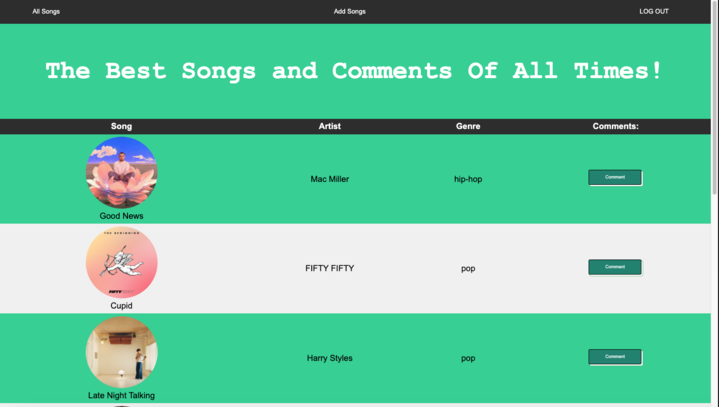
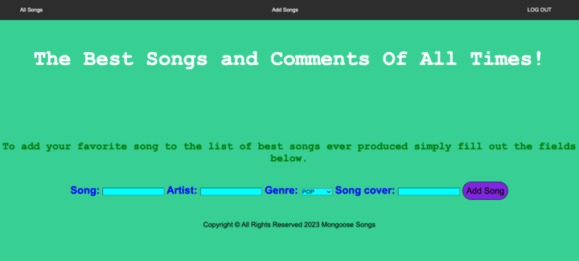
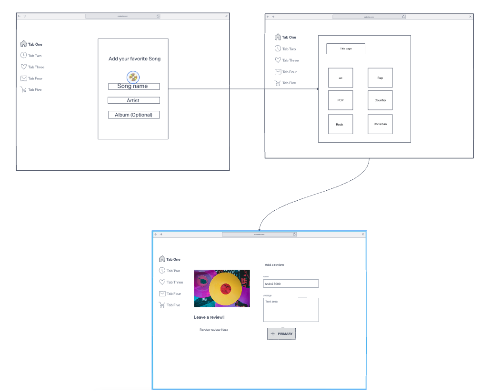
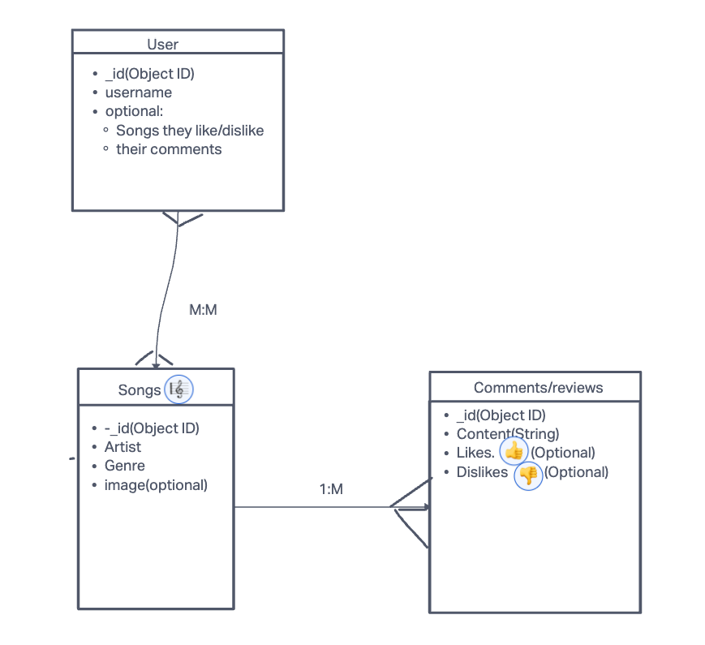

## Intro
This is a music database where users can create and add comments/reviews on recently added songs. 
A consistently updating library of inconsistent genres, albums and artists. Feel free to add your taste and comments to any song you see on the page. 

# Key Features:
User have a collections of songs to view. User's can sign in to their account to have access to some of our newest features such as adding a new song and leaving a comment on it. Editing and deleting your comments. More features to come.
#

## Website previews:

## Try the website here:

https://nameless-shelf-90495.herokuapp.com/

## Wireframe & ERD: 

Wireframe

ERD

# Team members
## Jessica
## Michael

## MVP Goals:
Add songs to the database. Allow users to leave a comment on any song. Edit and delete their own comments.

## Stretch Goals:
A like and dislike feature. Add more images to the webpage.
